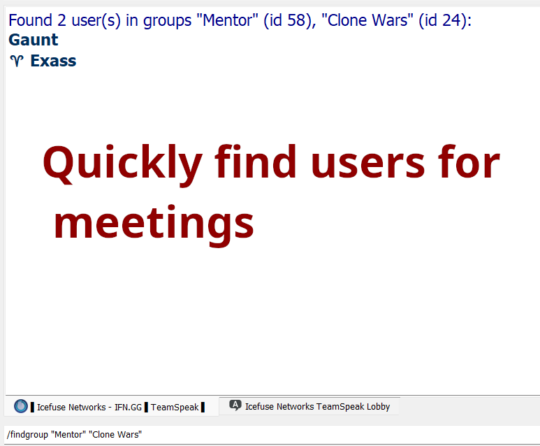

# ts3 plugin to find online users by their server groups. Made by PhysicsGaunt

To use: 

In a channel chat, type

```
/findgroup "[group1]" "[group2]"
```

this will show all online clients which have all the channel groups listed.




